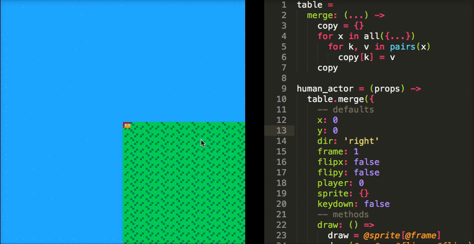

Picomoon
--

Compile moonscript to .p8 carts and reload on-the-fly!

Installation
--

    npm i -g picomoon

Usage
--

    Usage: picomoon [options] <file ...>
    
    Options:
    
    -h, --help           output usage information
    -V, --version        output the version number
    -x, --root [path]    Path to pico-8 carts. Defaults to ~/Library/Application Support/pico-8/carts
    -o, --output [file]  Write output to file
    -p, --print          Write output to std out
    -w, --watch          Watch file
    -r, --reload         Reload PICO-8 after write
